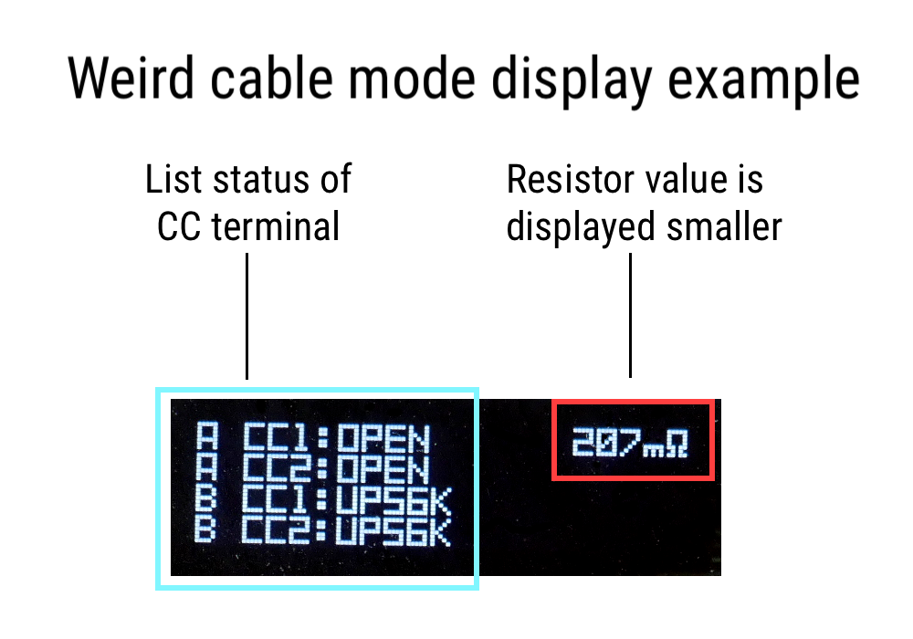
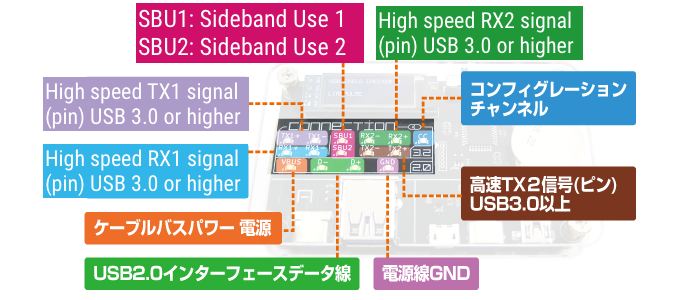

# USB CABLE CHECKER2 instruction manual

## Function introduction

This product has the following functions.

------

- USB Check the wire wires of the cable

- Confirm the internal resistance value of the type C plug (whether or not the E Marker for PD)

- Confirmation of the resistance value of the power line

- Plug shell grounds confirmation

------

## Explanation of each part

## Before use: Notes

At the time of purchase, USBCABLECHECKER2 has a battery for operation confirmation.

The insulation sticker is sandwiched between the main unit, so please remove it before use.

In addition, the board is protected by acrylic, but please be careful when handling because the connector etc. are exposed.

** This product is a device dedicated to cable inspection. Do not connect other USB devices. There is a danger of damage.**

## How to use

- ** Judgment of plug conversion adapter **

After turning on the power of this product, connect the conversion adapter to either the connector on the A side or the connector on the B side.

If there is an internal resistance connected to the CC with a type C plug conversion connector, the resistance value is displayed on the OLED display.

If you have an OTG function, it will be displayed as "OTG Enable".

- ** Cable judgment **

After turning on the power of this product, connect the connector on the A side and the connector on the B side with a USB cable.

If the wire is connected, the LED corresponding to the "Connection" will light up.

- ** OLED display display part **

If both the VBUS and GND ** ** of the cable connected to the side A and the B side are connected, the display of the total ** ** of the VBUS line and the GND line resistance value is displayed on the display.
  
When a type C plug with a built -in resistance is connected to the plug, the pred -up/pull -down resistance value connected to the CC and the maximum permissive current that is notified to the connection device according to it is displayed.
  
If the 10k pull-down resistance is detected, it is determined as a Marked cable.

## OLED display display

### [Resistance value]

The total resistance of the GND line and the VBUS line.

This includes USB plug-connector contact resistance.The unit is millimeters, and the accuracy is ± 15 %.

The measurement limit is 1100mΩ, and more than that is displayed as "High".

### [UP10K/Source 3.0a]

Have a 10kΩ resistor connected between VBUS-CC in the C plug.

The host recognizes the USB device as the 3A current supply capacity.

The cable with this resistance value in the plug is out of USB standard.

### [UP22K/Source 1.5a]

Have a 22kΩ resistor connected between VBUS-CC in the C plug.

The host recognizes the USB device as a 1.5A current supply capacity.

The cable with this resistance value in the plug is out of USB standard.

### [UP56K/SOURCE 0.5A] 

Have a 56kΩ resistor connected between VBUS-CC in the C plug.

The host recognizes the USB device as a 0.5A current supply capacity.

This is the only value of the built -in connector -built -up resistance allowed by the USB standard.

### [DOWN1K/E-MARKED]

Have a 1kΩ resistor connected between GND-VConn in the C plug.

This will notify the connection destination USB device that it is a built -in e -marker IC cable.

### [DOWN5.1K/SINK 0.5A]

Have a 5.1kΩ resistor connected between GND-CC in the C plug.

As a result, the connection USB device works as a host if possible.

### [OTG　ENABLE]

Although it is not a resistor, it lights up when the GND-ID terminal of the mini-b and micro-b connector is short.

As a result, the connection USB device works as a host if possible.

### [SHELL-GND SHORT(SIDE)]

It is displayed when the plug shell is conducted with GND.In (), the connector on the controlled side represents either A, B.

If the connectors on both sides are conducted, it will be displayed as A & B.

In the Type C-C cable, it is stipulated that the GND and the shell are connected by the standard.

### [SHIELD CONNECT]

"SHIELD CONNECT" is displayed when the shells at both ends are connected by a wire independent of GND.

Normally, the shielding wire of the legacy USB cable is only connected to one of the ends, and there is no continuity between the ends.

## Weird cable (Strange cable) mode

If multiple CC pull-up or pull-down resistors on a cable or plug are detected, the display will look different than usual.

Enter display mode. In this display mode, the resistance value is displayed small, and the state of the shell and shield is no longer displayed.

The status of the terminals of all CCs on the A side and B side is listed. This function is useful for finding Type-C cables that do not comply with the USB standard, such as being indistinguishable from the front and back.

## Commentary on the wire connection confirmation LED

### [3.2]　

It is a wire used for USB3.2 connection. The name of the differential line conforms to the terminal name on the A side connector side.

### CC

Wires used mainly for hosts and devices and USB PD communications in TypeC cables.

Various functions are exchanged between devices through this wire.

### SBU

It is a wire used to exchange data (audio, video, etc.) other than USB data communication as Side Band Use.

It is mainly used in alternate mode.

### TX1/2 as well as RX1/2

It is a wire that performs communication with USB3.0 or later.

In USB3.0, data communication (SUPERSPEED / SS) using 2 pairs of wires,

For USB3.2 or later, we perform data communication (SuperSpeed+ / SS+) using 4 pairs of wires.

### [2.0]

A wire used for USB1.0 ~ USB2.0 connection.

### D

A wire used to perform data communication up to USB2.0 (Lowspeed / Full Speed and High Speed).

### VBUS and GND

It is a wire used for power management.

## How to replace the battery

When starting up, when "Low Battery" is displayed on the OLED display, it is time to replace the battery.

As shown in the image above, remove the leverage principle by sliding the tip of the flathead screwdriver into the gap between the minus terminal and the battery.

After that, attach the new CR2032 battery plus on the side.

Official page http://bit-trade-ne.co.jp/adusbcim
