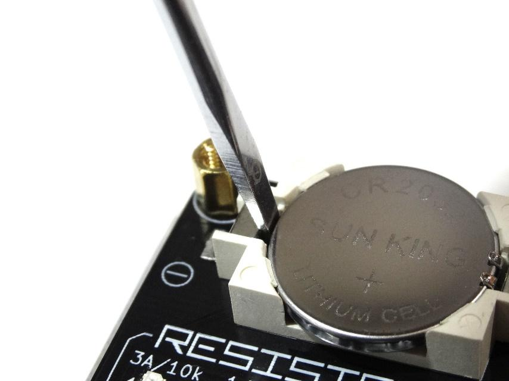

# USB CABLE CHECKER 2 instruction manual

## Function introduction

**This product has the following functions:**
- USB Check the wire wires of the cable
- Confirm the internal resistance value of the type C plug (whether or not the E Marker for PD)
- Confirmation of the resistance value of the power line
- Plug shell grounds confirmation

------

## Explanation of each part

------

## Before use: Notes

At the time of purchase, USBCABLECHECKER2 has a battery for operation confirmation.

The insulation sticker is sandwiched between the main unit, so please remove it before use.

In addition, the board is protected by acrylic, but please be careful when handling because the connector etc. are exposed.

**This product is a device dedicated to cable inspection. Do not connect other USB devices. There is a danger of damage.**

------

## How to use

### **Testing USB conversion adapters**

After turning the power on, connect the conversion adapter to either the connector on the A side or the connector on the B side.

If there is an internal resistance connected to the CC with a type C plug conversion connector, the resistance value is displayed on the OLED display.

If you have an OTG function, it will be displayed as "OTG Enable".

### **Testing USB cables**

After turning the power on, connect the connector on the A side and the connector on the B side with a USB cable.

If the wire is connected, the LED corresponding to the "Connection" will light up.

### **OLED display display part**

If both VBUS and GND of the cable connected to the A side and B side are connected, the total resistance value of the VBUS line and GND line resistance value will be displayed on the display.

When a type C plug with a built-in resistor is connected inside the plug, the value of the pull-up / pull-down resistor connected to the CC and the maximum allowable current value notified to the connected device corresponding to it are displayed.

If a 10k pull-down resistor is detected, it is judged as a MARKED cable.

------

## OLED display display

- **[Resistance value]**

  The total resistance of the GND line and VBUS line.

  This includes USB plug-connector contact resistance. The unit is milliohms (mΩ) and the accuracy is ±15%.

  The measurement limit value is 1100 mΩ, and above that, "HIGH" is displayed.

- **[UP10K / SOURCE 3.0A]**

  It has a 10kΩ resistor connected between VBUS and CC in the C plug.

  Makes the USB device recognize that the host can supply a current of 3A.

  Cables with resistance of this resistance value inside the plug are not USB standard.

- **[UP22K / SOURCE 1.5A]**

  It has a 22kΩ resistor connected between VBUS and CC in the C plug.

  Makes the USB device recognize that the host has a current supply capacity of 1.5A.

  Cables with resistance of this resistance value inside the plug are not USB standard.

- **[UP56K / SOURCE 0.5A]**

  It has a 56kΩ resistor connected between VBUS and CC in the C plug.

  Makes the USB device recognize that the host has a current supply capacity of 0.5A.

  This is the only pull-up resistor with a built-in connector that is permitted by the USB standard.

- **[DOWN1K / E-MARKED]**

  It has a 1kΩ resistor connected between GND and VCONN in the C plug.

  This notifies the connected USB device that it is a cable with a built-in E marker IC.

- **[DOWN5.1K / SINK 0.5A]**

  It has a 5.1kΩ resistor connected between GND and CC in the C plug.

  This allows the connected USB device to act as a host if possible.

- **[OTG ENABLE]**

  Although it is not a resistor, it lights up when the GND-ID terminals of the Mini-B and Micro-B connectors are short-circuited.

  This allows the connected USB device to act as a host if possible.

- **[SHELL-GND SHORT(SIDE)]**

  Displayed when the plug shell is connected to GND. The numbers in parentheses indicate whether the connector on the conducting side is A or B.

  If the connectors on both sides are conducting, A & B is displayed.

  For type C-C cables, the standard stipulates that GND and the shell are connected.

- **[SHIELD CONNECT]**

  "SHIELD CONNECT" is displayed when the shells at both ends are connected by a wire independent of GND.

  Normally, the shielding wire of the legacy USB cable is only connected to one of the ends, and there is no continuity between the ends.

------

## Weird cable (Strange cable) mode

If multiple CC pull-up or pull-down resistors on a cable or plug are detected, the display will look different than usual.

Enter display mode. In this display mode, the resistance value is displayed small, and the state of the shell and shield is no longer displayed.

The status of the terminals of all CCs on the A side and B side is listed. This function is useful for finding Type-C cables that do not comply with the USB standard, such as being indistinguishable from the front and back.

------

## Wire indicator status LEDs

- **[3.2]**

  This is the wire used for USB3.2 connection. The name of the differential line conforms to the terminal name on the A side connector side.

- **CC**

  This wire is mainly used for host and device identification and USB PD communication in Type C cables.

  "Availability" of various functions is exchanged between devices through this wire.

- **SBU**

  This is the wire used when exchanging data (audio, video, etc.) other than USB data communication as Side Band Use.

  Mainly used in alternate mode.

- **TX1 / 2 and RX1 / 2**

  This is the wire that communicates with USB3.0 or later.

  With USB3.0, data communication uses two pairs of wires (SuperSpeed ​​/ SS).

  With USB3.2 or later, data communication uses 4 pairs of wires. (SuperSpeed​​+ / SS+)

- **[2.0]**

  This wire is used for USB1.0 - USB2.0 connection.

- **D**

  This wire is used for data communication (Low Speed ​​/ Full Speed ​​and High Speed) up to USB2.0.

- **VBUS and GND**

  This wire is used for power management.

------

## USB Speeds

| Mode        | Data Rate               | Introduced in |
| ----------- | ----------------------- | ------------- |
| Low speed   | 1.5 Mbit/s (187.5 KB/s) | USB 1.0       |
| Full speed  | 12 Mbit/s (1.5 MB/s)    | USB 1.0       |
| High Speed  | 480 Mbit/s (60 MB/s)    | USB 2.0       |
| SuperSpeed  | 5 Gbit/s (625 MB/s)     | USB 3.0       |
| SuperSpeed+ | 10 Gbit/s (1.25 GB/s)   | USB 3.1       |
| SuperSpeed+ | 20 Gbit/s (2.5 GB/s)    | USB 3.2       |

------

## How to replace the battery

When starting up, if "Low Battery" is displayed on the OLED display, it is time to replace the battery.

As shown in the image above, slide the tip of a flathead screwdriver into the gap between the minus terminal and the battery. Then lever the battery out of the socket.

After that, insert the new CR2032 battery, with the positive side facing up.

------

## Further information

[Official page](http://bit-trade-ne.co.jp/adusbcim)
